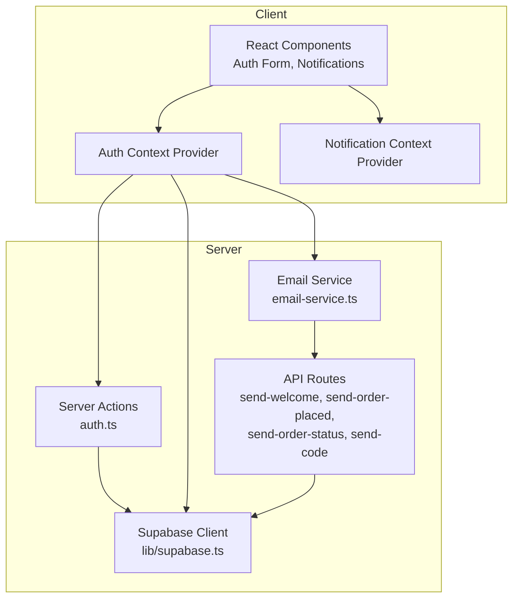
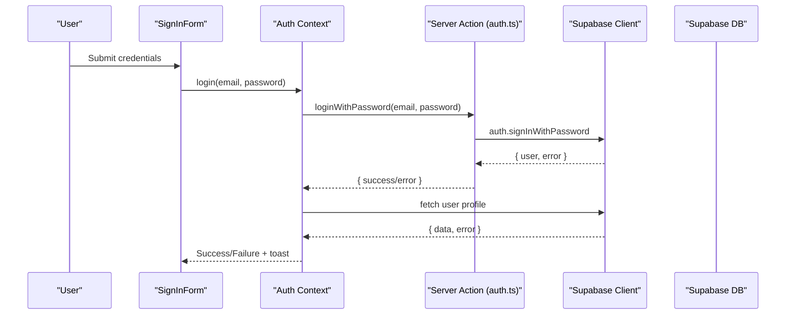
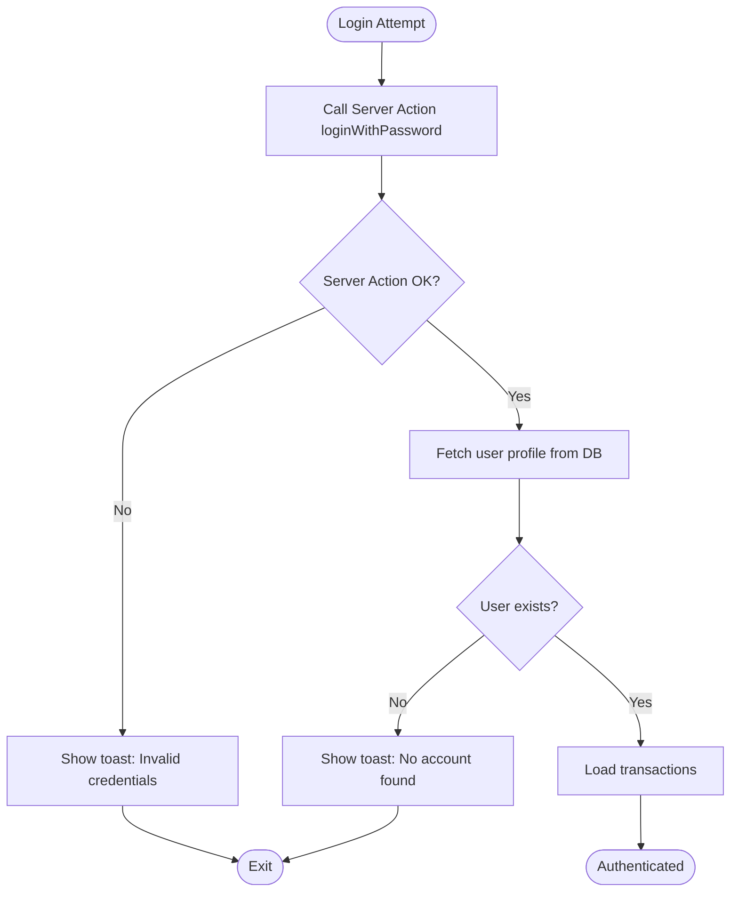
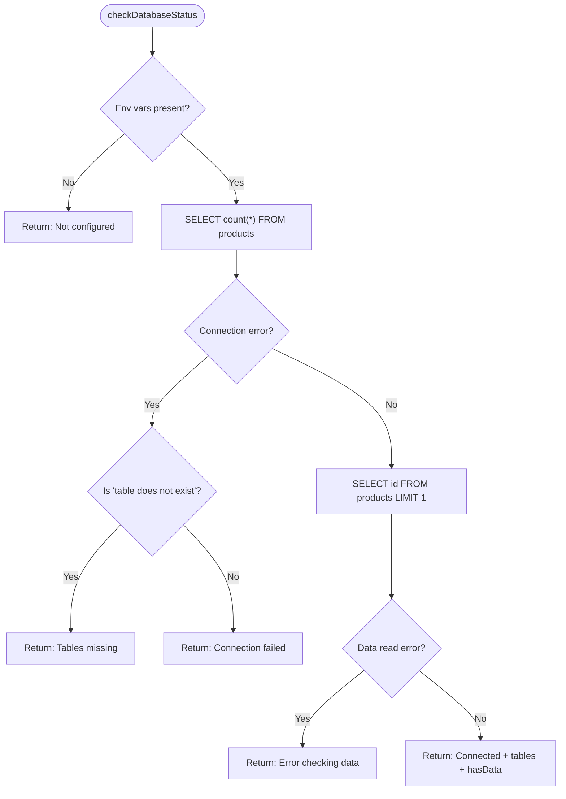
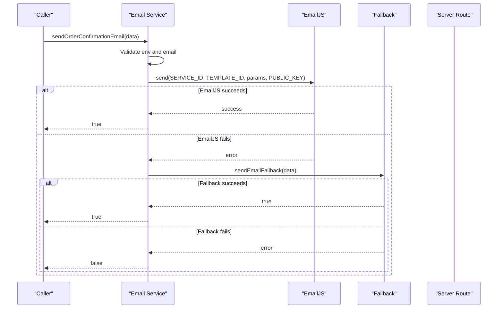
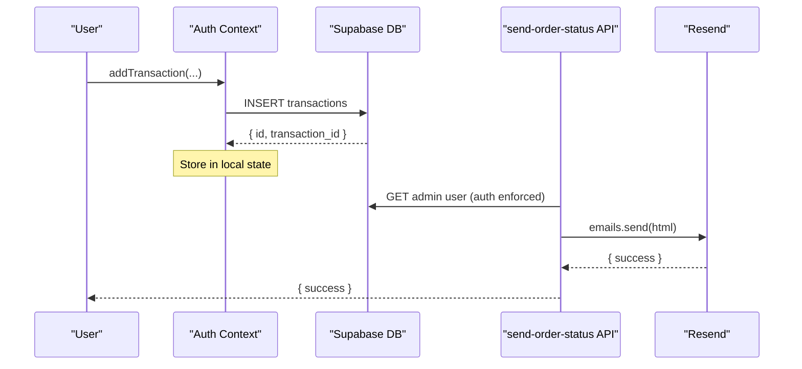
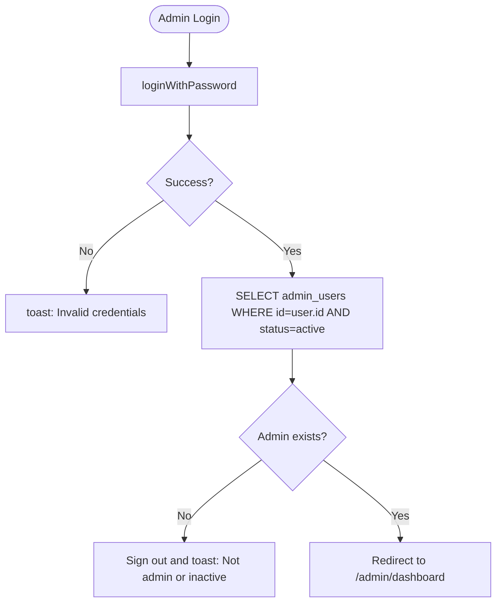
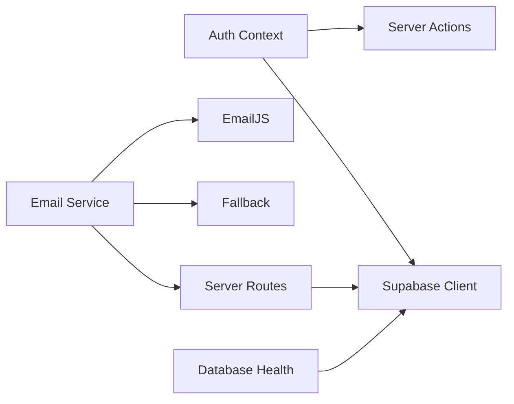

# Troubleshooting and FAQ

<cite>
**Referenced Files in This Document**
- [supabase.ts](file://lib/supabase.ts)
- [auth-context.tsx](file://lib/auth-context.tsx)
- [auth.ts](file://app/actions/auth.ts)
- [email-service.ts](file://lib/email-service.ts)
- [email-fallback.ts](file://lib/email-fallback.ts)
- [send-welcome/route.ts](file://app/api/send-welcome/route.ts)
- [send-order-placed/route.ts](file://app/api/send-order-placed/route.ts)
- [send-order-status/route.ts](file://app/api/send-order-status/route.ts)
- [send-code/route.ts](file://app/api/send-code/route.ts)
- [database-init.ts](file://lib/database-init.ts)
- [notification-context.tsx](file://lib/notification-context.tsx)
- [sign-in-form.tsx](file://components/sign-in-form.tsx)
- [admin-login/page.tsx](file://app/admin/login/page.tsx)
- [middleware.ts](file://middleware.ts)
</cite>

## Table of Contents
1. [Introduction](#introduction)
2. [Project Structure](#project-structure)
3. [Core Components](#core-components)
4. [Architecture Overview](#architecture-overview)
5. [Detailed Component Analysis](#detailed-component-analysis)
6. [Dependency Analysis](#dependency-analysis)
7. [Performance Considerations](#performance-considerations)
8. [Troubleshooting Guide](#troubleshooting-guide)
9. [Conclusion](#conclusion)
10. [Appendices](#appendices)

## Introduction
This document provides a comprehensive troubleshooting guide and FAQ for the Byiora platform. It focuses on diagnosing and resolving common issues across authentication errors, database connectivity, email delivery failures, and payment processing errors. It also covers debugging approaches for React components, context providers, and serverless functions, along with best practices for error prevention, monitoring, and reliability.

## Project Structure
The Byiora platform is a Next.js application with:
- Client-side React components and context providers
- Server Actions for authentication
- Supabase client/server utilities for database access
- Email services backed by EmailJS and Resend with a fallback mechanism
- Serverless API routes for transaction-related email notifications
- Middleware for session management

**Diagram sources**
- [auth-context.tsx:1-374](file://lib/auth-context.tsx#L1-L374)
- [auth.ts:1-68](file://app/actions/auth.ts#L1-L68)
- [email-service.ts:1-126](file://lib/email-service.ts#L1-L126)
- [send-welcome/route.ts:1-69](file://app/api/send-welcome/route.ts#L1-L69)
- [send-order-placed/route.ts:1-90](file://app/api/send-order-placed/route.ts#L1-L90)
- [send-order-status/route.ts:1-188](file://app/api/send-order-status/route.ts#L1-L188)
- [send-code/route.ts:1-91](file://app/api/send-code/route.ts#L1-L91)
- [supabase.ts:1-188](file://lib/supabase.ts#L1-L188)

**Section sources**
- [supabase.ts:1-188](file://lib/supabase.ts#L1-L188)
- [auth-context.tsx:1-374](file://lib/auth-context.tsx#L1-L374)
- [auth.ts:1-68](file://app/actions/auth.ts#L1-L68)
- [email-service.ts:1-126](file://lib/email-service.ts#L1-L126)
- [send-welcome/route.ts:1-69](file://app/api/send-welcome/route.ts#L1-L69)
- [send-order-placed/route.ts:1-90](file://app/api/send-order-placed/route.ts#L1-L90)
- [send-order-status/route.ts:1-188](file://app/api/send-order-status/route.ts#L1-L188)
- [send-code/route.ts:1-91](file://app/api/send-code/route.ts#L1-L91)
- [database-init.ts:1-164](file://lib/database-init.ts#L1-L164)
- [notification-context.tsx:1-242](file://lib/notification-context.tsx#L1-L242)
- [sign-in-form.tsx:1-208](file://components/sign-in-form.tsx#L1-L208)
- [admin-login/page.tsx:1-145](file://app/admin/login/page.tsx#L1-L145)
- [middleware.ts:1-11](file://middleware.ts#L1-L11)

## Core Components
- Authentication: Client-side context provider orchestrates login/signup/logout and integrates with Supabase and server actions. It surfaces user data, transactions, and error feedback via toast notifications.
- Database connectivity: Supabase client and typed database schema define tables and relationships. A health-check utility validates environment configuration and table presence.
- Email delivery: EmailJS is used for primary delivery; a fallback method logs and simulates sending. Serverless routes deliver welcome, order confirmation, order status updates, and gift card codes.
- Notifications: Real-time notifications are loaded, marked read, and broadcast via Supabase realtime channels.

**Section sources**
- [auth-context.tsx:1-374](file://lib/auth-context.tsx#L1-L374)
- [supabase.ts:1-188](file://lib/supabase.ts#L1-L188)
- [database-init.ts:1-164](file://lib/database-init.ts#L1-L164)
- [email-service.ts:1-126](file://lib/email-service.ts#L1-L126)
- [email-fallback.ts:1-31](file://lib/email-fallback.ts#L1-L31)
- [send-welcome/route.ts:1-69](file://app/api/send-welcome/route.ts#L1-L69)
- [send-order-placed/route.ts:1-90](file://app/api/send-order-placed/route.ts#L1-L90)
- [send-order-status/route.ts:1-188](file://app/api/send-order-status/route.ts#L1-L188)
- [send-code/route.ts:1-91](file://app/api/send-code/route.ts#L1-L91)
- [notification-context.tsx:1-242](file://lib/notification-context.tsx#L1-L242)

## Architecture Overview
The platform follows a layered architecture:
- Presentation layer: React components and context providers
- Application layer: Server Actions and API routes
- Data layer: Supabase client and typed schema
- Integration layer: EmailJS and Resend for email delivery

**Diagram sources**
- [sign-in-form.tsx:1-208](file://components/sign-in-form.tsx#L1-L208)
- [auth-context.tsx:1-374](file://lib/auth-context.tsx#L1-L374)
- [auth.ts:1-68](file://app/actions/auth.ts#L1-L68)
- [supabase.ts:1-188](file://lib/supabase.ts#L1-L188)

## Detailed Component Analysis

### Authentication Flow and Error Handling
Common authentication errors include invalid credentials, account not found, and server action failures. The system surfaces user-friendly messages via toast and logs detailed errors for debugging.

**Diagram sources**
- [auth-context.tsx:129-163](file://lib/auth-context.tsx#L129-L163)
- [auth.ts:8-23](file://app/actions/auth.ts#L8-L23)

**Section sources**
- [auth-context.tsx:129-163](file://lib/auth-context.tsx#L129-L163)
- [auth.ts:8-23](file://app/actions/auth.ts#L8-L23)
- [sign-in-form.tsx:27-45](file://components/sign-in-form.tsx#L27-L45)

### Database Connectivity Health Checks
Database connectivity issues commonly stem from misconfigured environment variables or missing tables. The health checker distinguishes between configuration errors, missing tables, and runtime errors.

**Diagram sources**
- [database-init.ts:27-87](file://lib/database-init.ts#L27-L87)

**Section sources**
- [database-init.ts:11-24](file://lib/database-init.ts#L11-L24)
- [database-init.ts:27-87](file://lib/database-init.ts#L27-L87)

### Email Delivery Failures and Fallback Mechanism
Email delivery failures can occur due to missing EmailJS configuration, invalid email addresses, or transport errors. The system attempts EmailJS first and falls back to a logging-based method.

**Diagram sources**
- [email-service.ts:75-126](file://lib/email-service.ts#L75-L126)
- [email-fallback.ts:3-30](file://lib/email-fallback.ts#L3-L30)

**Section sources**
- [email-service.ts:75-126](file://lib/email-service.ts#L75-L126)
- [email-fallback.ts:3-30](file://lib/email-fallback.ts#L3-L30)

### Payment Processing and Transaction Status Updates
Payment processing errors surface as transaction failures. The system records transactions and allows status updates via admin routes, which trigger order status emails.

**Diagram sources**
- [auth-context.tsx:240-323](file://lib/auth-context.tsx#L240-L323)
- [send-order-status/route.ts:1-188](file://app/api/send-order-status/route.ts#L1-L188)

**Section sources**
- [auth-context.tsx:240-323](file://lib/auth-context.tsx#L240-L323)
- [send-order-status/route.ts:17-21](file://app/api/send-order-status/route.ts#L17-L21)
- [send-order-status/route.ts:174-182](file://app/api/send-order-status/route.ts#L174-L182)

### Admin Login and Authorization
Admin login requires valid credentials and an active admin record. Unauthorized or inactive admin accounts are rejected.

**Diagram sources**
- [admin-login/page.tsx:23-61](file://app/admin/login/page.tsx#L23-L61)

**Section sources**
- [admin-login/page.tsx:23-61](file://app/admin/login/page.tsx#L23-L61)

## Dependency Analysis
- Auth Context depends on Supabase client and server actions for authentication and user/profile operations.
- Email Service depends on EmailJS and Resend; it falls back to a logging-based method when primary services fail.
- API routes depend on Supabase for user verification and on Resend for email delivery.
- Database health checks depend on Supabase client and environment variables.

**Diagram sources**
- [auth-context.tsx:1-374](file://lib/auth-context.tsx#L1-L374)
- [auth.ts:1-68](file://app/actions/auth.ts#L1-L68)
- [email-service.ts:1-126](file://lib/email-service.ts#L1-L126)
- [email-fallback.ts:1-31](file://lib/email-fallback.ts#L1-L31)
- [send-welcome/route.ts:1-69](file://app/api/send-welcome/route.ts#L1-L69)
- [database-init.ts:1-164](file://lib/database-init.ts#L1-L164)
- [supabase.ts:1-188](file://lib/supabase.ts#L1-L188)

**Section sources**
- [auth-context.tsx:1-374](file://lib/auth-context.tsx#L1-L374)
- [auth.ts:1-68](file://app/actions/auth.ts#L1-L68)
- [email-service.ts:1-126](file://lib/email-service.ts#L1-L126)
- [email-fallback.ts:1-31](file://lib/email-fallback.ts#L1-L31)
- [send-welcome/route.ts:1-69](file://app/api/send-welcome/route.ts#L1-L69)
- [database-init.ts:1-164](file://lib/database-init.ts#L1-L164)
- [supabase.ts:1-188](file://lib/supabase.ts#L1-L188)

## Performance Considerations
- Minimize redundant database queries by batching reads and caching user/session data in context.
- Use server actions for sensitive operations to reduce client-side exposure and leverage server-side caching.
- Email operations should be asynchronous and non-blocking; avoid long-running synchronous calls in UI components.
- Monitor email delivery latency and retry counts; implement exponential backoff for transient failures.
- Use Supabase realtime channels judiciously to avoid unnecessary load; unsubscribe on unmount.

## Troubleshooting Guide

### Authentication Errors
Symptoms:
- “Invalid credentials” toast appears on login.
- “No account found with this email.” after successful server action.

Diagnosis steps:
- Verify server action returns success and user object.
- Confirm user exists in the users table and fetch succeeds.
- Check Supabase auth logs for failed sign-in attempts.

Resolution:
- Ensure correct email/password combination.
- Confirm the user’s account exists and is not deleted or anonymized.
- Review toast messages and console logs for detailed error context.

Practical example:
- Trigger login from the sign-in form; observe toast feedback and console logs in the auth context.

**Section sources**
- [auth-context.tsx:129-163](file://lib/auth-context.tsx#L129-L163)
- [auth.ts:8-23](file://app/actions/auth.ts#L8-L23)
- [sign-in-form.tsx:27-45](file://components/sign-in-form.tsx#L27-L45)

### Database Connectivity
Symptoms:
- “Supabase not configured” warnings.
- “Database tables do not exist” or connection failures.

Diagnosis steps:
- Run database status checks to confirm environment variables and table existence.
- Attempt read operations on products, users, and transactions tables.
- Inspect error messages for SQL error codes indicating missing tables.

Resolution:
- Set NEXT_PUBLIC_SUPABASE_URL and NEXT_PUBLIC_SUPABASE_ANON_KEY.
- Execute setup scripts to create tables.
- Re-run health checks to confirm connectivity and data presence.

Practical example:
- Use the database health checker to detect missing tables and log actionable errors.

**Section sources**
- [database-init.ts:11-24](file://lib/database-init.ts#L11-L24)
- [database-init.ts:27-87](file://lib/database-init.ts#L27-L87)
- [database-init.ts:114-163](file://lib/database-init.ts#L114-L163)

### Email Delivery Failures
Symptoms:
- Welcome email or order emails not sent.
- Console logs show EmailJS failures and fallback attempts.

Diagnosis steps:
- Verify NEXT_PUBLIC_EMAILJS_* environment variables are set.
- Check Resend API key and rate limits.
- Inspect server route responses for 4xx/5xx statuses.
- Validate email addresses and sanitize inputs.

Resolution:
- Configure EmailJS and Resend credentials.
- Implement retry logic with backoff for transient transport errors.
- Ensure server routes are reachable and not blocked by CORS or middleware.

Practical example:
- Attempt to send an order confirmation email; observe fallback behavior and logs.

**Section sources**
- [email-service.ts:75-126](file://lib/email-service.ts#L75-L126)
- [email-fallback.ts:3-30](file://lib/email-fallback.ts#L3-L30)
- [send-welcome/route.ts:7-68](file://app/api/send-welcome/route.ts#L7-L68)
- [send-order-placed/route.ts:8-89](file://app/api/send-order-placed/route.ts#L8-L89)
- [send-order-status/route.ts:8-187](file://app/api/send-order-status/route.ts#L8-L187)
- [send-code/route.ts:8-90](file://app/api/send-code/route.ts#L8-L90)

### Payment Processing Errors
Symptoms:
- Transactions stuck in “Processing”.
- Users report failed payments.

Diagnosis steps:
- Verify transaction insertion succeeded and local state updated.
- Confirm admin-only status update route is called with proper authorization.
- Check order status email delivery for completion or failure templates.

Resolution:
- Update transaction status to “Failed” with remarks and notify user via order status email.
- Provide refund information and support contact details in the email template.
- Log transaction IDs for reconciliation.

Practical example:
- Add a transaction via the auth context and update its status through the admin route.

**Section sources**
- [auth-context.tsx:240-323](file://lib/auth-context.tsx#L240-L323)
- [send-order-status/route.ts:17-21](file://app/api/send-order-status/route.ts#L17-L21)
- [send-order-status/route.ts:174-182](file://app/api/send-order-status/route.ts#L174-L182)

### Debugging React Components and Context Providers
Common issues:
- Toast messages not appearing or incorrect timing.
- Context not providing user data or stale state.

Debugging steps:
- Wrap components with appropriate providers (AuthProvider, NotificationProvider).
- Use React DevTools to inspect provider state and prop drilling.
- Add console logs around context hooks and server action calls.
- Verify middleware updates sessions and cookies for protected routes.

Practical example:
- Use the sign-in form to trigger login and inspect context state and toast messages.

**Section sources**
- [sign-in-form.tsx:18-80](file://components/sign-in-form.tsx#L18-L80)
- [auth-context.tsx:51-92](file://lib/auth-context.tsx#L51-L92)
- [notification-context.tsx:29-170](file://lib/notification-context.tsx#L29-L170)
- [middleware.ts:4-6](file://middleware.ts#L4-L6)

### Serverless Function Issues
Common issues:
- Unauthorized or forbidden responses from admin routes.
- Missing or malformed request bodies.

Debugging steps:
- Validate Supabase auth getUser() and admin user lookup.
- Sanitize and validate input fields (email, status, transactionId).
- Check server logs for thrown exceptions and returned JSON bodies.

Resolution:
- Ensure admin users have active status and proper roles.
- Return structured error responses with appropriate HTTP status codes.

**Section sources**
- [send-order-status/route.ts:10-21](file://app/api/send-order-status/route.ts#L10-L21)
- [send-order-placed/route.ts:10-31](file://app/api/send-order-placed/route.ts#L10-L31)
- [send-code/route.ts:10-35](file://app/api/send-code/route.ts#L10-L35)

### Error Boundaries, Error Reporting, and User-Friendly Messages
Current patterns:
- Toast notifications for immediate user feedback.
- Console logging for developers.
- Structured error responses in server routes.

Recommendations:
- Implement a global error boundary to catch unhandled promise rejections and display friendly messages.
- Integrate client-side error reporting (e.g., logging library) to capture stack traces and user actions.
- Centralize error messages and provide actionable next steps (contact support, retry later).
- Add correlation IDs to requests for cross-system tracing.

[No sources needed since this section provides general guidance]

## Conclusion
Byiora’s error-handling strategy combines user-friendly messaging, robust server-side validation, and resilient email delivery. Use the diagnostic steps and examples in this guide to quickly isolate and resolve authentication, database, email, and payment issues. Adopt the recommended best practices to prevent errors, monitor system health, and maintain reliability.

## Appendices

### Quick Reference: Common Error Scenarios and Fixes
- Authentication errors: Verify credentials, check user existence, review server action responses.
- Database connectivity: Confirm environment variables, run health checks, create missing tables.
- Email delivery failures: Configure EmailJS/Resend, validate inputs, implement retries and fallback.
- Payment processing errors: Update transaction status with remarks, send appropriate order status emails, provide refund info.

[No sources needed since this section provides general guidance]